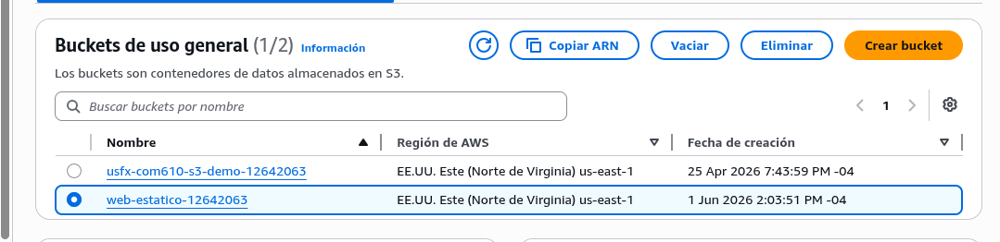
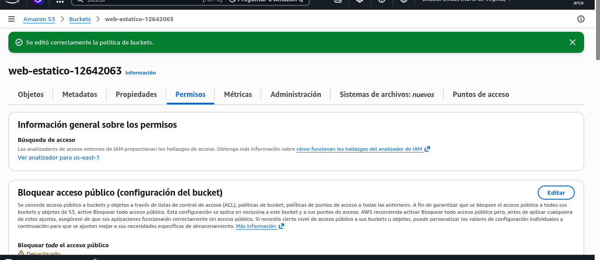
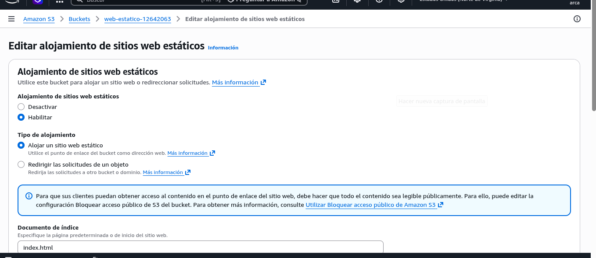
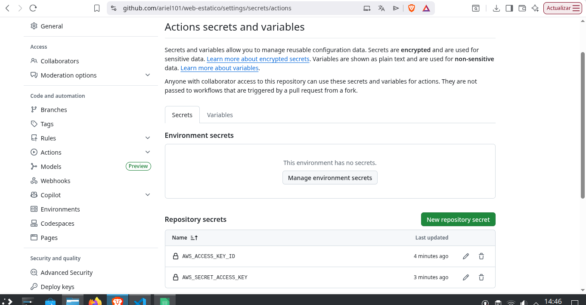
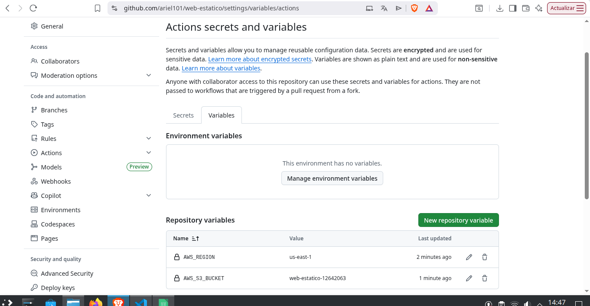
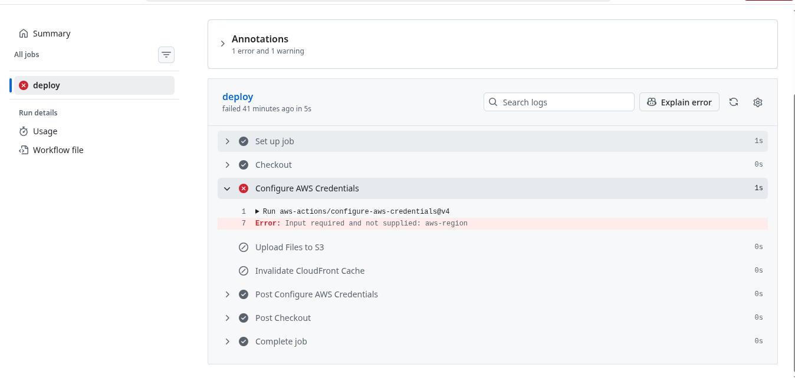
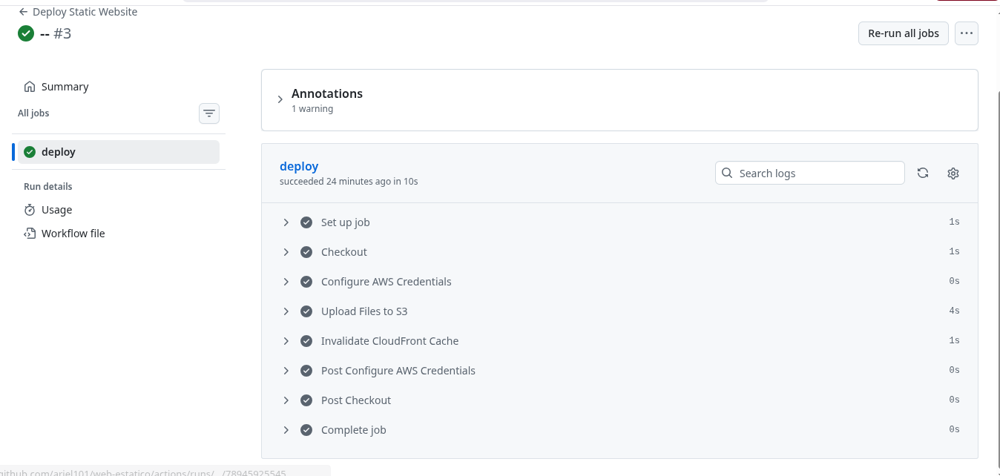
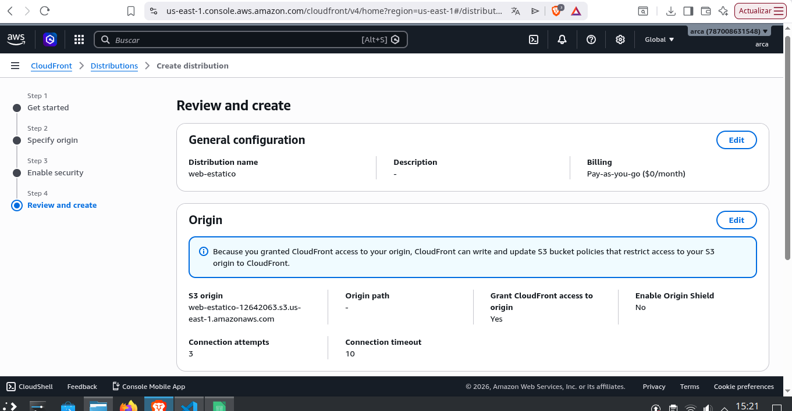
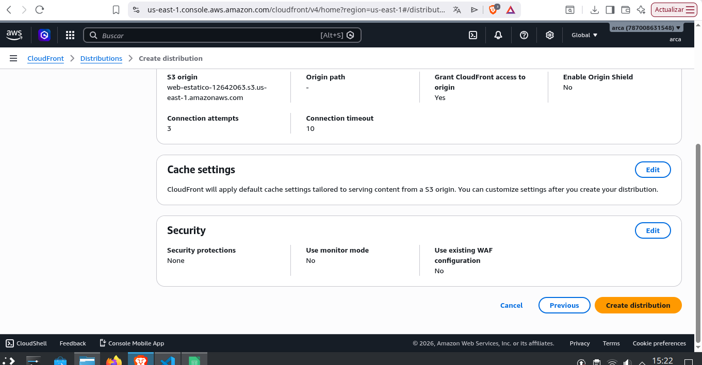

# INFORME DEL LABORATORIO

## 2. Arquitectura

GitHub → Actions → S3 → CloudFront

## 3. Configuración del bucket S3

## 4. Configuración de GitHub Secrets

## 5. Pipeline CI/CD

Explicación del workflow.

## 6. Evidencia de ejecución fallida

## 7. Evidencia de ejecución exitosa

## 8. Distribución CloudFront

## 9. Sitio desplegado

URL S3:
...

URL CloudFront:
...

[Captura]

## 10. Conclusiones

- El despliegue continuo reduce errores manuales.
- GitHub Actions automatiza la publicación.
- CloudFront mejora rendimiento y disponibilidad.
- OAC protege el bucket S3.